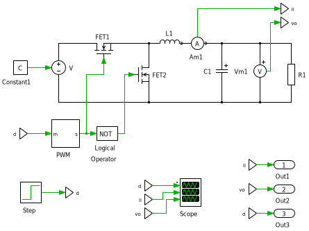

User guide
==========

This page shows how to build PLECS models and Python scripts so that simulations can be automated with ``plecsutil``. 

* :ref:`sec-user-guide-intro`: basics to create PLECS models, the ``model.py`` files, and running the simulation with ``plecsutil``

* :ref:`sec-user-guide-working-controllers`: basics to create PLECS models with single or multiple controllers

* :ref:`sec-user-guide-save-load`: Saving and loading simulation results

.. _sec-user-guide-intro:

Introduction
------------

Creating the PLECS model
~~~~~~~~~~~~~~~~~~~~~~~~

To work with ``plecsutil``, the PLECS model needs at least two elements: an output data port in the top-level circuit, and a link to the ``.m`` file containing the model parameters. 

The output data port (or ports) in the top-level circuit defines which signals are sent to Python at the end of each simulation. A data port can contain a single signal, or many signals can be multiplexed and connected to a single data port. :numref:`fig-user-guide-schematic` shows an example of a Buck converter with output data ports in the top-level circuit. (You can download the example by clicking :download:`here <media/user_guide/intro/buck_intro.plecs>`.)

   
   PLECS model with output data port in the top-level circuit.

The link to the ``.m`` file is given in the initialization tab of the simulation parameters, as shown in :numref:`fig-user-guide-initialization`. It is important that the name of the ``.m`` matches the name of the PLECS  model (the simulation file). Thus, if the name of the PLECS model is ``buck_intro.plecs``, the name of the initialization file must be indicated in the simulation parameters must be ``buck_intro.m``.

.. figure:: media/user_guide/intro/images/initialization.png
   :name: fig-user-guide-initialization
   :scale: 50%
   :align: center
   :alt: Initialization of simulation parameters .
   
   Initialization of the simulation parameters.

Creating the Python script
~~~~~~~~~~~~~~~~~~~~~~~~~~

Running the PLECS simulation requires creating a :class:`plecsutil.ui.PlecsModel` object informing the name of the PLECS model, its path, and a Python dictionary containing all of the parameters of the model.

An example of a Python script is shown below. Note that the script assumes to be in the same folder as that the PLECS model, since it defines the ``plecs_file_path`` as the current working directory.

.. literalinclude:: media/user_guide/intro/buck_intro.py
   :caption: Running a PLECS simulation with ``plecsutil`` (:download:`download source <media/user_guide/intro/buck_intro.py>`)
   :language: python

In this example, when calling :meth:`plecsutil.ui.PlecsModel.sim` to run the simulation, ``plecsutil`` will generate a ``.m`` file. This files contains the model parameters given by the ``model_params`` dictionary is used to initialize the :class:`plecsutil.ui.PlecsModel` object. After generating the ``.m`` file, the simulation is launched, which then uses the ``.m`` as source.

Simulation results
~~~~~~~~~~~~~~~~~~

After running a simulation, :meth:`plecsutil.ui.PlecsModel.sim` returns a :class:`plecsutil.ui.DataSet` dataclass holding the simulation results. In addition to the data points, :class:`plecsutil.ui.DataSet` contains a ``meta`` field. This field has  a dictionary with a ``model_params`` entry that  stores the  model parameters used to produce the associated simulation results. Thus, the simulation results are always saved with the parameters used to produce them.

Running simulations with different model parameters
~~~~~~~~~~~~~~~~~~~~~~~~~~~~~~~~~~~~~~~~~~~~~~~~~~~

The :meth:`plecsutil.ui.PlecsModel.sim` accepts a ``sim_params`` dictionary that can be used to overwrite the default model parameters defined when initializing the :class:`plecsutil.ui.PlecsModel` object. The ``sim_params`` dictionary doesn't need to contain all model parameters, but just the parameters to be overwritten. In the example Python script shown above, calling :meth:`plecsutil.ui.PlecsModel.sim` as

.. code-block:: python
   
   data = pm.sim({'R': 4})

will run the simulation with ``R = 4``, instead of the default value of 10 defined by ``model_params``.

An example of running the simulation of the Buck converter with different ``R`` values is shown below. In this example, :meth:`plecsutil.ui.PlecsModel.sim` is called with ``sim_params`` specifying different values for ``R``.

.. literalinclude:: media/user_guide/intro/buck_intro_var_r.py
   :caption: Running the PLECS model with different model parameters (:download:`download source <media/user_guide/intro/buck_intro_var_r.py>`)
   :language: python

The ``model.py`` file
~~~~~~~~~~~~~~~~~~~~~

In the previous examples, the dictionary containing the model parameters (``model_params``) was defined in the script that runs the simulation. This makes managing the model parameters more difficult when there are multiple Python scripts to perform different simulations of the same model. In the Buck model used as example, one might create one script to run the model with different values for ``R``, and another one for different values of ``f_pwm``. If the parameters of the PLECS model need to be updated, all scripts need to be modified to include the new parameters.

This can be avoided by creating a ``model.py`` associated with the PLECS model. In this way, the model parameters are defined in a single location, and all scripts  running simulations can simply import the model from the ``model.py`` file. 

Although the ``model.py`` can be created and define the dictionary with the model parameters, it is more flexible to create a function that returns the parameters instead. The advantages of this approach become clear when adding controllers to the simulation.

For the Buck example discussed thus far, we can create an associated ``model.py`` with the following contents:

.. literalinclude:: media/user_guide/intro/model.py
   :caption: Example of ``model.py`` file (:download:`download source <media/user_guide/intro/model.py>`)
   :language: python

Now, ``model.py`` can be imported by Python scripts to get the model parameters. For example, to run the Buck converter model with varying values for ``R``:

.. literalinclude:: media/user_guide/intro/buck_intro_model.py
   :caption: Using ``model.py`` to run simulations (:download:`download source <media/user_guide/intro/buck_intro_model.py>`)
   :language: python

.. _sec-user-guide-working-controllers:

Working with controllers
------------------------

It is often interesting to see how a closed-loop system behaves, especially when changing controller parameters. There are also case where we have more than one controller and would like to compare them. ``plecsutil`` provides a way to define controllers as part of the model, and vary their parameters. 

Single controller
~~~~~~~~~~~~~~~~~

When the model has a single controller, changing the parameters of the controller can be done much in the same way as changing the parameters of the model. After all, the controller is part of the model. However, it is often the case that we don't want to specify the controller gains directly, but rather through some other specifications. For example, we may have a design method, where we specify the settling time of the controller to get the gains. Then, it is a question of concatenating the parameters of the plant with the parameters of the controller, in order to create a single dictionary with all parameters of the model. 

Consider state-feedback controller for a Buck converter shown in :numref:`fig-user-guide-controllers-sfb-buck`. This controller has two parameters, which are part of the model parameters: the vector ``Kx`` and the gain ``Ke``. 

   
   State-feedback controller for a Buck converter.

These two gains can be determined based on time response specifications of the closed-loop system, such as settling time and overshoot. This is possible with pole placement, based on a model of the converter. 

Now, we can identify two sets of parameters: the plant parameters, and the controller parameters. These two combined compose the model parameters. In our ``model.py`` file, we can then create three functions: one for the parameters of the plant, one for the parameters of the controller, and one that concatenates them. An example of such structure is shown in the script below.

.. literalinclude:: media/user_guide/controllers/single/model.py
   :caption: ``model.py`` with plant, controller and model parameters (:download:`download source <media/user_guide/controllers/single/model.py>`)
   :language: python

Note that the ``controller_gains`` gain function takes as argument a dictionary, which contains the parameters of the controller. In this case, the parameters are ``ts`` (settling time) and ``os`` (overshoot). The function also returns a dictionary, containing the gains that are used in the model.

When there is a  controller, ``plecsutil`` is made aware of it by informing the function that returns the controller gains when creating the :class:`plecsutil.ui.PlecsModel` object. When running the simulation, the user can set the parameters of the controller and pass them to :meth:`plecsutil.ui.PlecsModel.sim`. Internally,  ``plecsutil`` calls the function to get the gains, and updates the parameters of the model automatically. This is demonstrated in the script below.

.. literalinclude:: media/user_guide/controllers/single/buck_single_controller.py
   :caption: Running a simulation with a single controller (:download:`download source <media/user_guide/controllers/single/buck_single_controller.py>` and :download:`PLECS model <media/user_guide/controllers/single/buck_single_controller.plecs>`)
   :language: python

Note that :meth:`plecsutil.ui.PlecsModel.sim` is called with ``ctl_params`` set to ``{'ts': 2.5e-3, 'os': 5}``. These parameters are used to generate the controller gains, which in turn are updated in the model parameters file.

Now, running the simulation with different controller parameters is just a matter of calling :meth:`plecsutil.ui.PlecsModel.sim` with different control parameters. An example is demonstrated in the script below.

.. literalinclude:: media/user_guide/controllers/single/buck_single_controller_var_params.py
   :caption: Running a simulation with different controller parameters (:download:`download source <media/user_guide/controllers/single/buck_single_controller_var_params.py>`)
   :language: python

Multiple controllers
~~~~~~~~~~~~~~~~~~~~

There are many cases where we would like to have multiple controllers in the model, so that we can easily compare them. This case is also supported in ``plecsutil``, by following a couple of rules in the PLECS model, and by defining the controllers as an :class:`plecsutil.ui.Controller` object. 

First, let's consider the Buck model we've been using so far, and let's assume we want to compare two controllers: a state feedback and a cascaded controller. First, we define our controller as a configurable subsystem in PLECS, as shown in  :numref:`fig-user-guide-controllers-multiple-controller`. 

.. figure:: media/user_guide/controllers/multiple/images/controllers.svg
   :name: fig-user-guide-controllers-multiple-controller
   :scale: 85%
   :align: center
   :alt: Buck model with two controllers as configurable subsystem
   
   Buck model with controllers as a configurable subsystem (:download:`download model <media/user_guide/controllers/multiple/buck_multiple_controllers.plecs>`).

Next, we open  the configurable subsystem (right-click on subsystem, Subsystem, Open subsystem) and create the controllers there. For this example, we've created two subsystems: ``state_feedback`` and ``cascaded``, representing the controllers we want to compare. This is shown in :numref:`fig-user-guide-controllers-multiple-controller-subsys`. 

   
   Controllers in the configurable subsystem.

Now, we go back to the `Controller` subsystem (:numref:`fig-user-guide-controllers-multiple-controller`), double click on the configurable subsystem containing the controllers, and in the `Configuration` option we select ``<reference>`` and type ``CTL_SEL``, as shown in :numref:`fig-user-guide-controllers-multiple-controller-subsys-cfg`.

   
   Setting `CTL_SEL` as the configuration of the configurable subsystem.

Now, we will build the ``model.py`` file much in the same way as before. We can create one function for the parameters of the plant, and one function for each controller. Then, a single function is created to concatenate all the parameters in a single model parameter dictionary. A script for this is shown below.

.. literalinclude:: media/user_guide/controllers/multiple/model.py
   :caption: ``model.py`` file for multiple controllers (:download:`download source <media/user_guide/controllers/multiple/model.py>`)
   :language: python

In the script above, there  are two main differences compared to the single controller case. The first one is that the ``params`` function includes a call to :func:`plecsutil.ui.gen_controllers_params`. This function generates the variable ``CTL_SEL`` seen in  :numref:`fig-user-guide-controllers-multiple-controller-subsys-cfg`, which is used to select the controller. The second difference is that at the end of the script, a ``CONTROLLERS`` dictionary is defined, containing the two controllers of the model. Each entry of this dictionary contains a label for the controller, and a :class:`plecsutil.ui.Controller` object initialized with a ``port`` number, a ``get_gains`` callback, and a ``label`` parameter. The value of ``port`` must match the pattern used in the subsystem of the model. Referring to :numref:`fig-user-guide-controllers-multiple-controller-subsys`, the subsystems are assigned indices starting at 1 and incrementing from left to right, i.e. ``state_feedback`` is index 1, and ``cascaded`` is index 2. These indices are assigned to the ``port`` parameter of the controllers, and the ``CTL_SEL`` is set according to the selected controller for the simulation. 

Now, we can finally build the script to run the simulations with different controllers, with an example given below. The :class:`plecsutil.ui.PlecsModel` is created as before, but now we give the controllers of the model with ``controllers=model.CONTROLLERS``. Then, when running the simulation, we give ``ctl_params`` just like we do for the single controller models, but we additionally give ``ctl``, which must be one of the controllers defined in ``model.CONTROLLERS``. Note that ``ctl_params`` changes for each controller (although they could also be the same).

.. literalinclude:: media/user_guide/controllers/multiple/buck_multiple_controllers.py
   :caption: Running models with multiple controllers (:download:`download source <media/user_guide/controllers/multiple/buck_multiple_controllers.py>`)
   :language: python

.. _sec-user-guide-save-load:

Saving and loading simulation results
-------------------------------------

With ``plecsutil``, it is possible to save and load simulations results. When calling :meth:`plecsutil.ui.PlecsModel.sim` to run a simulation, it is possible to automatically save the results after a simulation finishes by setting ``save`` to a nonempty string. For example, running

.. code-block:: python
   
   pm.sim(ctl='sfb', ctl_params={'ts':1.5e-3, 'os':5}, save='sfb_sim_results', ret_data=False)

will save the simulation results in a file called ``sfb_sim_results.zip``. The data is saved as a :class:`plecsutil.ui.DataSet` object, which includes simulation and meta data, such as model and controller parameters. 

Data is loaded with :func:`plecsutil.ui.load_data`:

.. code-block:: python
   
   data = pu.ui.load_data('sfb_sim_results')

``data`` is a :class:`plecsutil.ui.DataSet` object, and can be handled exactly in the same way as simulation results returned by :meth:`plecsutil.ui.PlecsModel.sim`.

.. warning::
   
   ``plecsutil`` uses `pickle <https://docs.python.org/3/library/pickle.html>`_ under the hood for serializing and de-serializing the simulation results. This is simple and efficient, but is not safe for file sharing. Only load simulation data that you generated yourself, or that you trust the source. 

